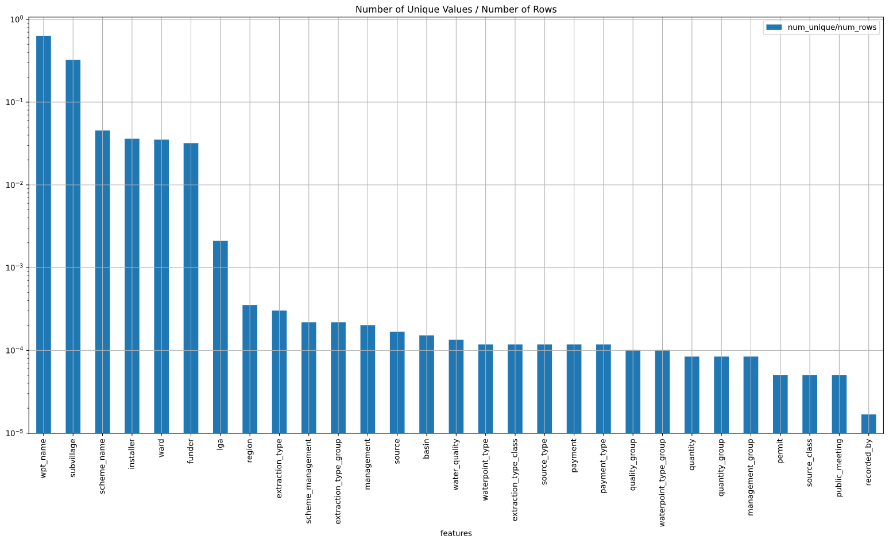
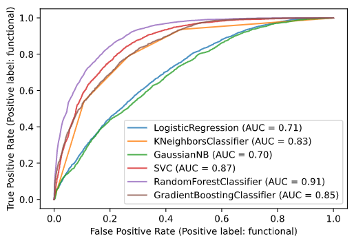
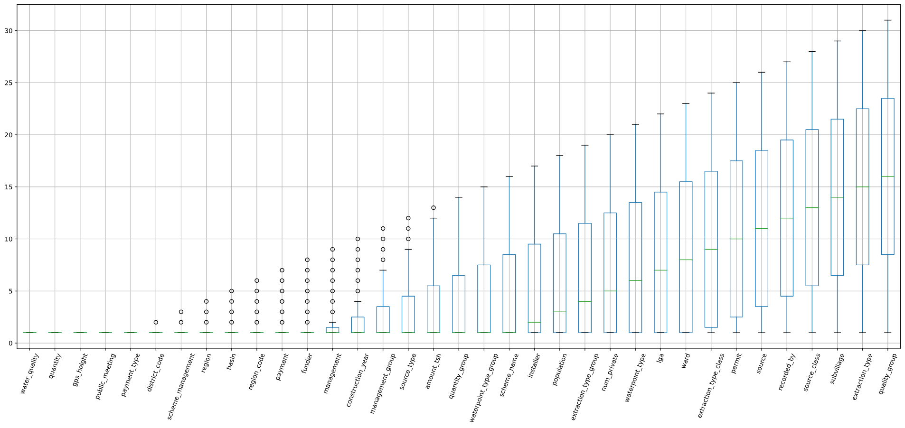
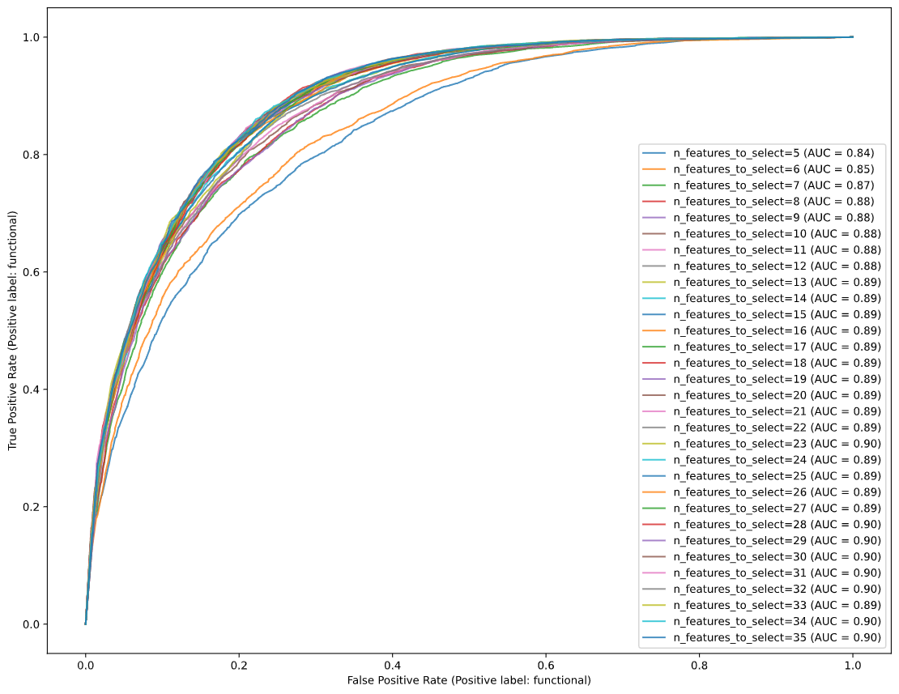
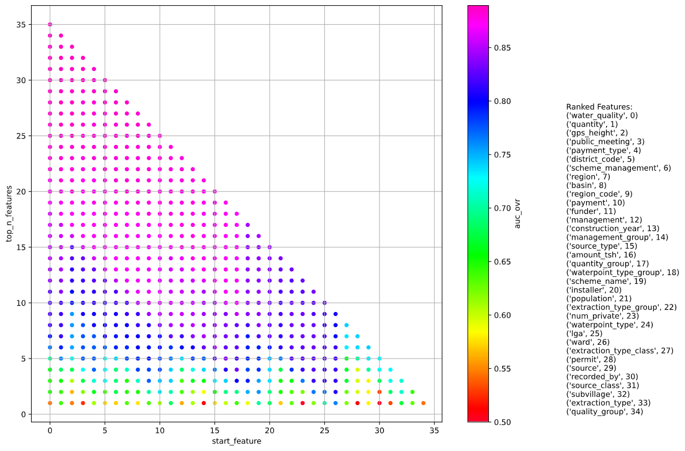
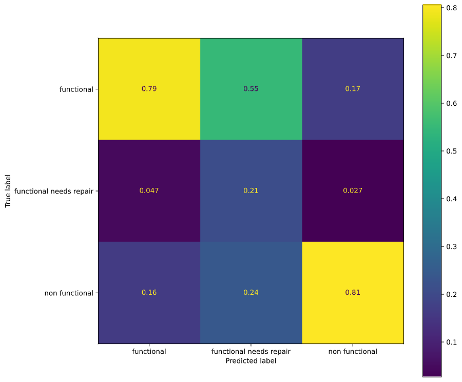
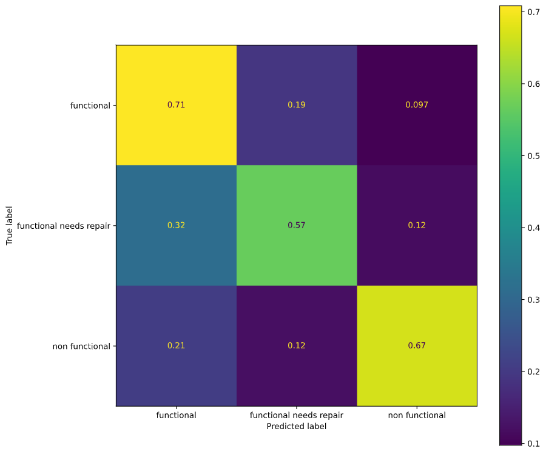
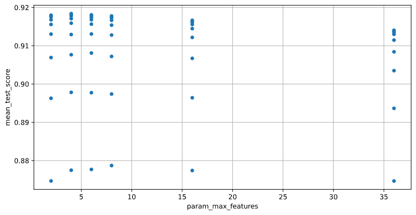
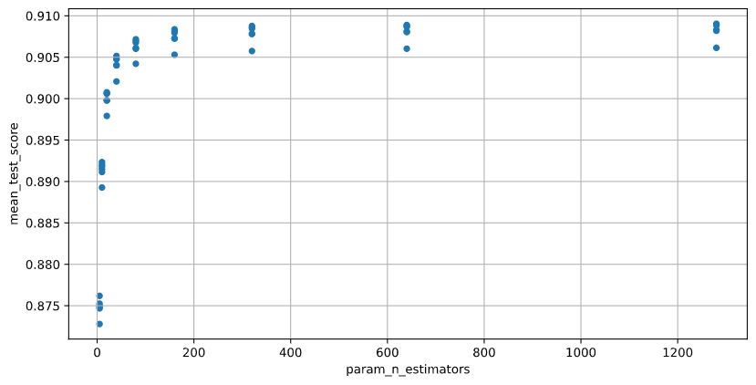

# Pump it Up: Data Mining the Water Table
## Summary and Recommendations
https://www.drivendata.org/competitions/7/pump-it-up-data-mining-the-water-table/

After analyzing the data , the following conclusions and recommendations are made:
1. Build a simpler model while real time updates the model. Could train multiple simple model based on date intervals as well.
2. Develop a categorical random forest library and visualization tools to further invest the correlation of “functional”, “functional needs repair”, and “non functional”. This can also help with the root cause investigation and physical prevention method development of the water pumps and wells.
3. The goal should be lower the false “functional” rate, since this slows the true “non functional” or “functional needs repair” replacement or repair process.

## Repository Files Organization
- presentation.pdf: the presentation slides for non-technical presentation.
- main.ipynb: the main Jupyter Notebook containing the data exploration and analysis.
- data: folder containing the movie raw data.
- images: folder containing images used for README.md

## Data
**Features:**
- amount_tsh - Total static head (amount water available to waterpoint)
- date_recorded - The date the row was entered
- funder - Who funded the well
- gps_height - Altitude of the well
- installer - Organization that installed the well
- longitude - GPS coordinate
- latitude - GPS coordinate
- wpt_name - Name of the waterpoint if there is one
- num_private -
- basin - Geographic water basin
- subvillage - Geographic location
- region - Geographic location
- region_code - Geographic location (coded)
- district_code - Geographic location (coded)
- lga - Geographic location
- ward - Geographic location
- population - Population around the well
- public_meeting - True/False
- recorded_by - Group entering this row of data
- scheme_management - Who operates the waterpoint
- scheme_name - Who operates the waterpoint
- permit - If the waterpoint is permitted
- construction_year - Year the waterpoint was constructed
- extraction_type - The kind of extraction the waterpoint uses
- extraction_type_group - The kind of extraction the waterpoint uses
- extraction_type_class - The kind of extraction the waterpoint uses
- management - How the waterpoint is managed
- management_group - How the waterpoint is managed
- payment - What the water costs
- payment_type - What the water costs
- water_quality - The quality of the water
- quality_group - The quality of the water
- quantity - The quantity of water
- quantity_group - The quantity of water
- source - The source of the water
- source_type - The source of the water
- source_class - The source of the water
- waterpoint_type - The kind of waterpoint
- waterpoint_type_group - The kind of waterpoint

**Labels**
- functional - the waterpoint is operational and there are no repairs needed
- functional needs repair - the waterpoint is operational, but needs repairs
- non functional - the waterpoint is not operational

**Uniqueness**

High fraction means the category has higher chance of self-identifying tendencies.

## Model
Random Forest is the best model when using default sklearn values:

Multiple random forests are made using different settings on the Recursive Feature Elimination  algorithm and the features are ranked. The boxplot shows statistic summary of the ranking:

- AUC score of Random Forests with different start_feature and top_n_features are ploted.
- Note that it that the best ranked feature may not guarantee the best AUC score.
- Also note that lower top_n_features used may not necessarily be the worse performance model. 

- Settings: start_feature=15, max_features=6, n_estimators=2. Selected to be simple to prove model performance doesn’t require extreme complexity.
  - AUC = 0.82
- It is most critical that when true “non functional” is predicted to “functional”.
- Also critical when true “functional needs repair” and predicted to be “functional”
- True Label Percentage:
  - This plot adds up to 1 row-wise.
  -21% of true “non-functional” will be predicted to be “functional” by the model. 12% true “functional needs repair” will be predicted to be “functional”.
- Prediction Label Percentage:
  -This plot adds up to 1 column-wise.
  -16% of predicted “functional” will be predicted to be true “non functional” by the model. 24% predicted “functional needs repair” will be predicted to be “non functional”.

- test_score = AUC
- Random Forest Models are iterated over:
  - n_estimators
  - max_features
- Performance doesn’t improve much over simpler models.

## Recommendations and Future Work
1. Build a simpler model while real time updates the model. Could train multiple simple model based on date intervals as well.
2. Develop a categorical random forest library and visualization tools to further invest the correlation of “functional”, “functional needs repair”, and “non functional”. This can also help with the root cause investigation and physical prevention method development of the water pumps and wells.
3. The goal should be lower the false “functional” rate, since this slows the true “non functional” or “functional needs repair” replacement or repair process.